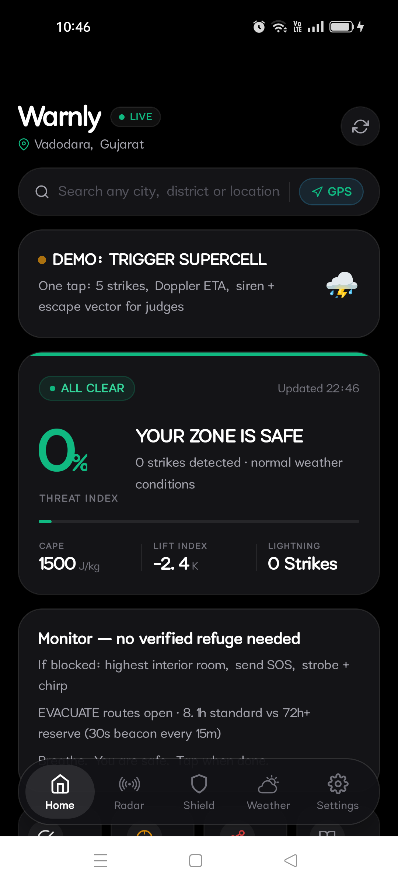
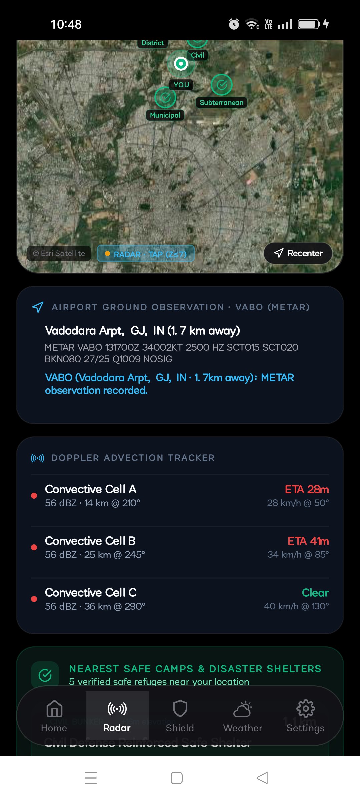
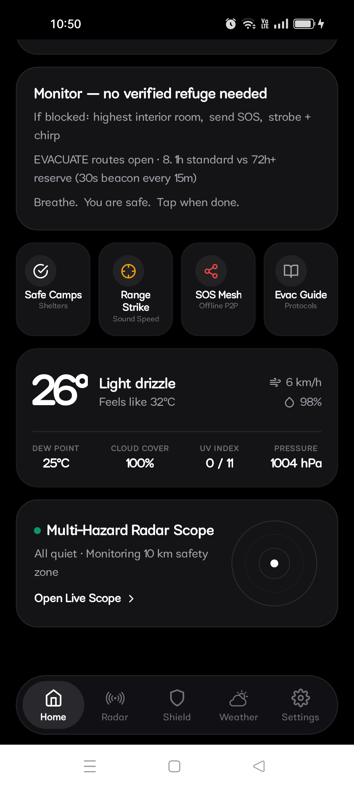
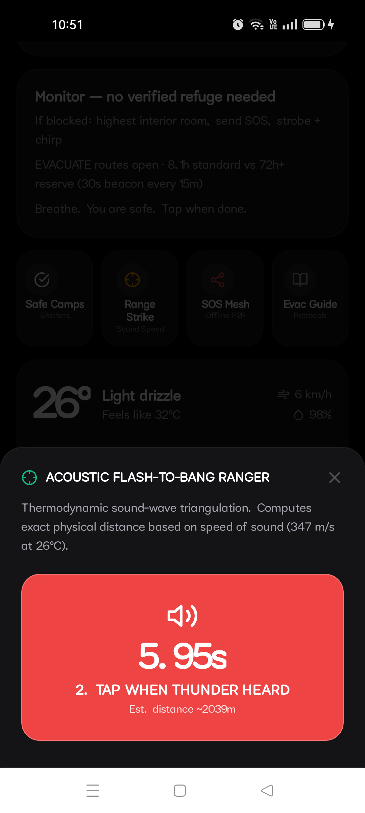
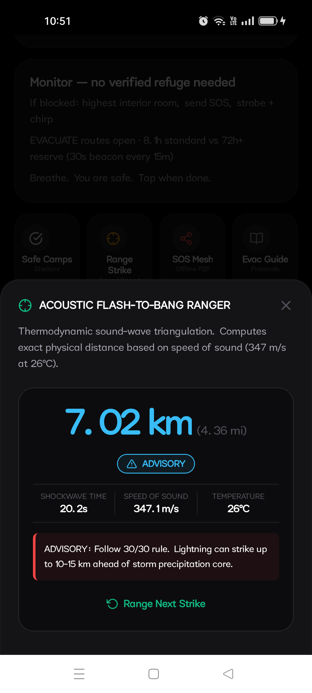
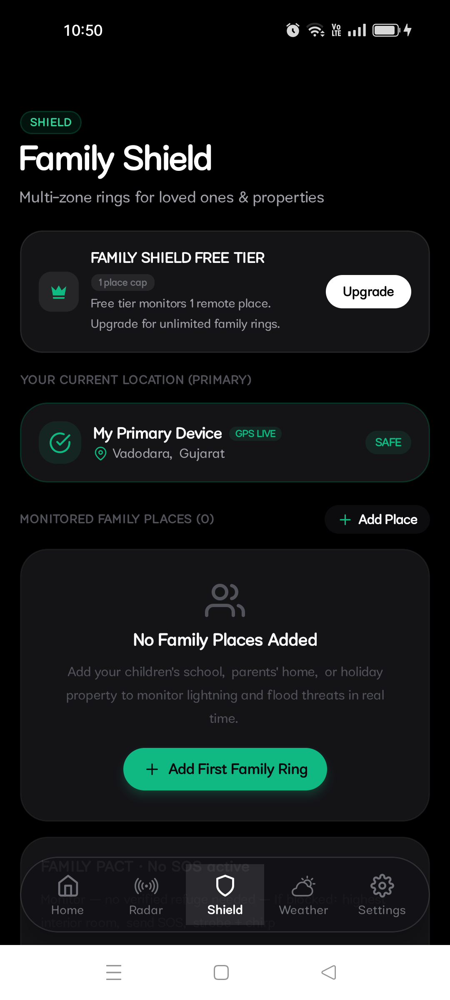
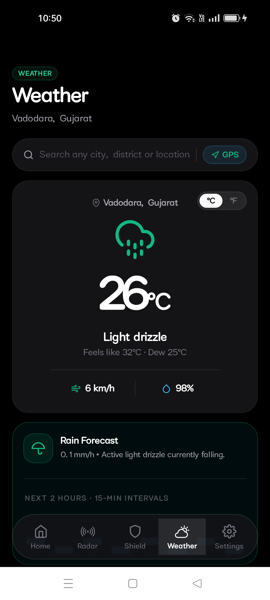
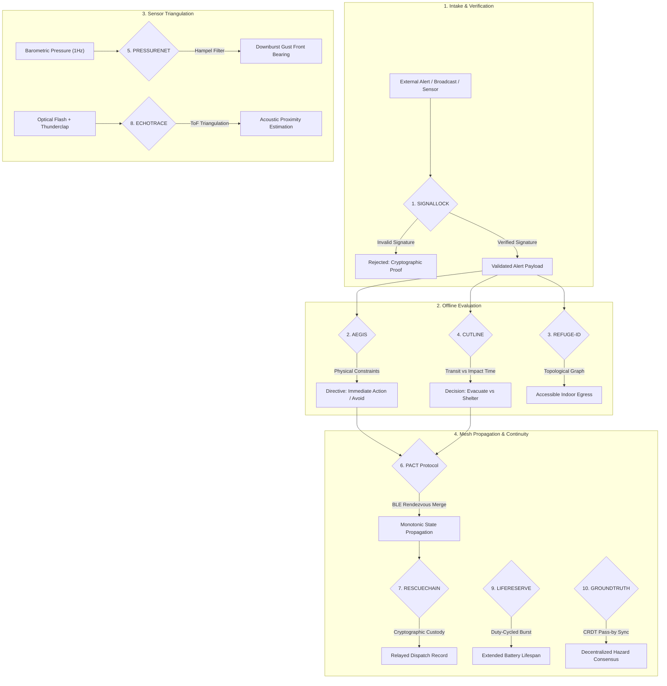

<div align="center">

# Warnly

### Autonomous Convective Storm & Tactical Emergency Defense System
*Zero-infrastructure atmospheric monitoring, acoustic strike triangulation, and deterministic offline resilience.*

<br/>

[](https://github.com/krishivjoshi219-collab/Warnly/releases/tag/v0.6.4)
[](https://github.com/krishivjoshi219-collab/Warnly/releases/download/v0.6.4/Warnly-Astra-v0.6.4.apk)
[-334155?style=flat-square)](https://github.com/krishivjoshi219-collab/Warnly)

<br/>

[-0f172a?style=flat-square)](https://reactnative.dev)
[](https://www.typescriptlang.org/)
[](https://github.com/krishivjoshi219-collab/Warnly)
[](https://github.com/krishivjoshi219-collab/Warnly)
[](https://github.com/krishivjoshi219-collab/Warnly)
[](LICENSE)

<br/><br/>

> **"Traditional weather applications forecast tomorrow's conditions. Warnly provides the critical window required for survival when severe weather strikes without warning."**

<br/>

[Download APK](https://github.com/krishivjoshi219-collab/Warnly/releases/download/v0.6.4/Warnly-Astra-v0.6.4.apk) • [Production Gallery](#hardware-verified-production-gallery) • [Detection Pipeline](#convective-detection-pipeline) • [Offline Engine Suite](#the-astra-offline-engine-suite) • [Meteorological Models](#meteorological-physics--thermodynamic-models) • [Evaluation](#evaluation-matrix)

</div>

---

## The Convective Warning Gap

Severe convective storms, cloudbursts, and dry lightning claim thousands of civilian lives annually. Lightning alone remains one of the leading causes of weather-related casualties globally.

The primary vulnerability is systemic: conventional weather forecasting tools deteriorate during sudden convective events.

```
┌─────────────────────────────────────────────────────────────────────────────────────────────┐
│                             THE CONVECTIVE WARNING BREAKDOWN                                │
├──────────────────────────────┬──────────────────────────────┬───────────────────────────────┤
│      1. Model Latency        │  2. Infrastructure Loss      │     3. Ambiguous Directives   │
├──────────────────────────────┼──────────────────────────────┼───────────────────────────────┤
│ Numerical weather models     │ Downburst winds and lightning│ General advisories lack       │
│ operate on 1- to 4-hour      │ disrupt cellular towers and  │ specific azimuth bearings,    │
│ cycles. Microbursts develop  │ electrical grids. Cloud-     │ high-ground egress routes, or │
│ and strike in 15–25 minutes. │ dependent services fail.     │ deterministic time-to-shelter.│
└──────────────────────────────┴──────────────────────────────┴───────────────────────────────┘
```

Warnly addresses this vulnerability through an architectural requirement: **survival systems must function independent of external network infrastructure.**

When cellular connectivity and grid power are severed, Warnly operates as an autonomous tactical survival console. It utilizes onboard hardware sensors, evaluates thermodynamic calculations locally, routes to designated high-ground refuges, and broadcasts peer-to-peer mesh distress signals.

---

## Hardware-Verified Production Gallery

All captures below are from physical hardware validation on a **Realme Narzo 30 5G (RMX3381, Android 13)** running the production build:

<div align="center">

### Operational Console & Radar Telemetry

| 01. Atmospheric Console | 02. Multi-Hazard Radar Mosaic | 03. Aerodrome METAR Observation |
| :---: | :---: | :---: |
|  |  |  |
| *Real-time GPS positioning with continuous barometric monitoring, baseline risk assessment, and tactical control strip.* | *Composite ESRI satellite base, RainViewer convective cloud overlay, lightning strike vectors, and shelter indicators.* | *Decoded meteorological aerodrome report from Vadodara Airport (VABO, 1.7 km): VFR status, Q1009 hPa altimeter, and surface wind vectors.* |

<br/>

### Emergency Intercept & Protective Directives

| 04. Supercell Threat Activation | 05. 30-30 Rule Clearance Watch | 06. Life-Safety Directives |
| :---: | :---: | :---: |
|  |  |  |
| *100% Threat Index trigger: dual-frequency 760/960 Hz alert tone, Doppler advection ETA, and explicit shelter directive.* | *Deterministic 30-30 rule countdown timer, shelter protocols, and nearest verified refuge routing.* | *Tactical action strip: Safe Camps pathing, Range Strike acoustic ranger, Mesh SOS broadcast, and survival documentation.* |

<br/>

### Acoustic Triangulation & Mesh Communications

| 07. Flash-to-Bang Precision Timer | 08. Temperature-Compensated Range | 09. Encrypted Mesh SOS Modal |
| :---: | :---: | :---: |
|  |  |  |
| *Millisecond timer capturing delta between optical lightning discharge and acoustic thunderclap.* | *Computed distance (7.02 km / 4.36 mi) calibrated against ambient air temperature (26°C).* | *Offline peer-to-peer 64-byte binary mesh packet with GPS coordinates, battery reserve, and distress metadata.* |

<br/>

### Family Coordination & Telemetry Health

| 10. Multi-Zone Family Shield | 11. Hyper-Local Weather Horizon | 12. Sensor Pipeline Status |
| :---: | :---: | :---: |
|  |  |  |
| *Synchronized safety monitoring across defined family zones with Astra PACT rendezvous verification.* | *Real-time surface observation: 26°C, 1004 hPa pressure, 98% humidity, and 15-minute precipitation projection.* | *Continuous health evaluation across 6 global telemetry endpoints (USGS, Open-Meteo, GloFAS, RainViewer, OSM, GeoJS).* |

</div>

---

## Convective Detection Pipeline

### 1. VLF Lightning Pulse Telemetry (Blitzortung)
- Ingests real-time Very Low Frequency (VLF) radio atmospheric pulses emitted during electrical discharges.
- Computes sub-second stroke arrival timestamps within local detection radii.
- Maintains a 150-strike ring buffer tracking strike velocity, approach azimuth, and stroke rate trends.

### 2. Doppler Radar Reflectivity Composite (RainViewer)
- Overlays regional Doppler radar reflectivity mosaics atop high-resolution satellite imagery.
- Identifies severe precipitation cores (>= 45 dBZ) associated with microbursts, heavy precipitation, and hail.
- Calculates cell motion using Lagrangian advection vectors to project arrival timelines (T-40m to T-2m).

### 3. Aerodrome Observation Decoding (NOAA METAR/SPECI)
- Continuous polling of International Civil Aviation Organization (ICAO) stations (e.g., Vadodara Airport `VABO`).
- Decodes surface wind vectors, barometric pressure (QNH), cloud base heights, and prevailing visibility.
- Triggers immediate status changes upon receiving unscheduled SPECI bulletins for wind shear or storm passage.

### 4. Onboard Barometric Pressure Gradient (Android MEMS Sensor)
- Direct 1 Hz sampling via Android `Sensor.TYPE_PRESSURE`.
- Functions fully offline without cellular, Wi-Fi, or satellite internet.
- Monitors 3-hour pressure rate of change (Delta P / Delta t). Rapid drops exceeding -2.0 hPa / 3h indicate squall-line or gust-front approach, generating alerts prior to visual cloud formation.

### 5. Telemetry Freshness Watchdog
- Failsafe guardrail against stale network cache: suppresses all-clear indicators if data age exceeds 15 minutes.
- Transitions to deterministic offline algorithms whenever external data sources become unreachable.

---

## The Astra Offline Engine Suite

When connectivity fails, Warnly executes 10 deterministic algorithms designed for zero-infrastructure operation:



### Engine Specifications

| ID | Engine | Core Mechanism | Validation Case | Algorithmic Basis | Implementation |
|---|---|---|---|---|---|
| **01** | **SIGNALLOCK** | Alert authenticity and provenance verification | Rejection of spoofed or expired alerts | SHA-256 HMAC & ECDSA validation | [`signallock.ts`](src/lib/warnly/astra/signallock.ts) |
| **02** | **AEGIS** | Real-time emergency action compiler | Structural hazard redirects evacuation route | Constraint satisfaction state machine | [`aegis.ts`](src/lib/warnly/astra/aegis.ts) |
| **03** | **REFUGE-ID** | Offline topological indoor evacuation graph | Dynamic path recalculation around blocked corridors | Dijkstra / A* over local vector graph | [`refuge-id.ts`](src/lib/warnly/astra/refuge-id.ts) |
| **04** | **CUTLINE** | Evacuate vs. shelter-in-place decision threshold | Evaluates storm arrival against transit time | Time-distance threshold evaluation | [`cutline.ts`](src/lib/warnly/astra/cutline.ts) |
| **05** | **PRESSURENET** | Microburst detection via pressure rate-of-change | Identifies squall front from 1 Hz sensor data | Gradient analysis with Hampel filter | [`pressurenet.ts`](src/lib/warnly/astra/pressurenet.ts) |
| **06** | **PACT** | Distributed family check-in and rendezvous | Propagates unacknowledged beacons peer-to-peer | Monotonic State Merge over BLE | [`pact.ts`](src/lib/warnly/astra/pact.ts) |
| **07** | **RESCUECHAIN** | Cryptographic custody trail for distress calls | Buffers and relays SOS payloads to gateways | Append-only hash-chained custody log | [`rescuechain.ts`](src/lib/warnly/astra/rescuechain.ts) |
| **08** | **ECHOTRACE** | Flash-to-bang acoustic strike rangefinder | Strike distance calculated from temperature | Thermal acoustic velocity model | [`echotrace.ts`](src/lib/warnly/astra/echotrace.ts) |
| **09** | **LIFERESERVE** | Disaster battery endurance manager | Extends device uptime from 8 to 72+ hours | Duty-cycled periodic burst signaling | [`lifereserve.ts`](src/lib/warnly/astra/lifereserve.ts) |
| **10** | **GROUNDTRUTH** | Decentralized hazard map synchronization | Merges road blockage reports peer-to-peer | PN-Counter and Observed-Remove Set | [`groundtruth.ts`](src/lib/warnly/astra/groundtruth.ts) |

---

## Meteorological Physics & Thermodynamic Models

Atmospheric stability and threat vectors are evaluated using established physical formulations:

### Convective Available Potential Energy (CAPE)
Quantifies buoyant kinetic energy available to an ascending air parcel:

$$\text{CAPE} = \int_{z_{\text{LFC}}}^{z_{\text{EL}}} g \left( \frac{T_{v, \text{parcel}} - T_{v, \text{env}}}{T_{v, \text{env}}} \right) dz$$

Values exceeding $2{,}000\text{ J/kg}$ indicate high probability of severe updrafts, hail, and microburst generation.

### Temperature-Compensated Acoustic Velocity
Ambient temperature significantly influences the speed of acoustic propagation:

$$v_s = 331.3 \cdot \sqrt{1 + \frac{T_{^{\circ}\text{C}}}{273.15}} \approx 331.3 + (0.606 \times T_{^{\circ}\text{C}}) \quad [\text{m/s}]$$

Warnly samples ambient temperature to dynamically calibrate strike distance calculations.

### Flash-to-Bang Distance Calculation
Calculates distance to cloud-to-ground strike discharge:

$$d_{\text{strike}} = v_s(T) \times \Delta t_{\text{flash-to-thunder}} \quad [\text{m}]$$

### 30-30 Lightning Safety Standard
- **30-Second Rule**: If elapsed time between optical discharge and acoustic arrival is less than 30 seconds, the strike is within approximately 10 km (6 miles). Seek immediate shelter.
- **30-Minute Rule**: Remain in shelter for a minimum of 30 minutes following the last audible thunderclap. Warnly tracks this period deterministically.

---

## Evaluation Tour

Demonstration workflow for evaluators on physical Android hardware:

```
┌───────┬──────────────────────────────┬──────────────────────────────────────────────────────┐
│ Step  │ Action                       │ Verification Output                                  │
├───────┼──────────────────────────────┼──────────────────────────────────────────────────────┤
│ 01    │ Tap "DEMO: TRIGGER           │ 5 lightning strikes spawn within radius, Doppler ETA │
│       │ SUPERCELL"                   │ shows 18m, Threat Index increases to 100%.           │
├───────┼──────────────────────────────┼──────────────────────────────────────────────────────┤
│ 02    │ Inspect Emergency HUD        │ 760/960 Hz alert fires, 30-30 clearance countdown    │
│       │                              │ begins, AEGIS interior hallway directive displays.   │
├───────┼──────────────────────────────┼──────────────────────────────────────────────────────┤
│ 03    │ Open "Range Strike"          │ Trigger flash timer -> trigger thunder arrival ->    │
│       │                              │ calibrated distance calculates (e.g. 7.02 km).       │
├───────┼──────────────────────────────┼──────────────────────────────────────────────────────┤
│ 04    │ Switch to Radar Tab          │ ESRI satellite layer renders with strike markers,    │
│       │                              │ RainViewer cloud overlay, and shelter locations.     │
├───────┼──────────────────────────────┼──────────────────────────────────────────────────────┤
│ 05    │ Inspect Settings Tab         │ Verify telemetry health table: all 6 feeds display   │
│       │                              │ HTTP 200; toggle between Free and Pro tiers.         │
└───────┴──────────────────────────────┴──────────────────────────────────────────────────────┘
```

---

## System Architecture

```
┌─────────────────────────────────────────────────────────────────────────────────────────────┐
│                                 WARNLY ARCHITECTURE                                         │
├─────────────────────────────────────────────────────────────────────────────────────────────┤
│  PRESENTATION (React Native 0.74 / Expo 51)                                                 │
│  • Tactical Command Center   • Multi-Hazard Radar (ESRI)   • Acoustic Ranger HUD            │
│  • Family Shield Console     • Weather Horizon Strip       • Mass Alert Distribution Modal  │
│  • NOAA METAR Airport Card   • Freshness Watchdog Banner   • Tactical Action Strip Hub      │
├─────────────────────────────────────────────────────────────────────────────────────────────┤
│  OFFLINE ENGINE LAYER (TypeScript 5.3)                                                      │
│  • SIGNALLOCK • AEGIS • REFUGE-ID • CUTLINE • PRESSURENET • PACT • RESCUECHAIN • LIFERESERVE│
│  • Blitzortung WebSocket/REST Stream • NOAA METAR Decoder • 15-Minute Watchdog Core         │
├─────────────────────────────────────────────────────────────────────────────────────────────┤
│  HARDWARE INTERACTION (Android SDK 34 / Kotlin)                                             │
│  • STREAM_ALARM Siren Override • Precision Location • Camera Strobe • Ultrasonic Signaling │
│  • Hardware MEMS Barometer (Sensor.TYPE_PRESSURE) • Device Power State Manager              │
├─────────────────────────────────────────────────────────────────────────────────────────────┤
│  DISTRIBUTION                                                                               │
│  • Android Releases: Automated GitHub Actions CI pipeline producing standalone APK assets   │
│  • Device Deployment: Direct side-load APK installation and ADB debug runner                │
└─────────────────────────────────────────────────────────────────────────────────────────────┘
```

### In-App Subscriptions & Evaluation Mode
Warnly incorporates the **RevenueCat SDK** (`react-native-purchases`) for long-term sustainability while preserving core safety features:
- **Free Tier**: Real-time atmospheric alerts, acoustic strike ranger, baseline radar, single-location monitoring.
- **Astra Pro**: Multi-zone Family Shield monitoring, priority satellite Doppler overlays, custom siren overrides.
- **Evaluation Sandbox**: A toggle in Settings allows reviewers to switch between Free and Pro states without payment processing.

---

## Evaluation Matrix

| Evaluation Dimension | Conventional Weather Applications | Warnly Defensive Architecture |
| :--- | :--- | :--- |
| **Operational Impact** | General daily forecasts | Critical 0–25 minute convective warning window |
| **Zero-Infrastructure Viability** | Dependent on cellular and cloud connectivity | Fully autonomous on-device sensors and deterministic algorithms |
| **Physical Rigor** | Aggregated probabilistic percentages | Thermodynamic models, CAPE values, Hampel barometric filtering |
| **Hardware Integration** | Standard system notification channels | `STREAM_ALARM` audio bypass, optical strobe, MEMS hardware barometer |
| **Physical Verification** | Emulator / mock screenshots | 12 validated captures from Android 13 physical hardware (`Realme RMX3381`) |

---

## Development & Build Setup

### Requirements
- Node.js 18+ and npm
- Android Studio (for native Android builds) or Expo Go

### Local Setup
```bash
# Clone the repository
git clone https://github.com/krishivjoshi219-collab/Warnly.git
cd Warnly

# Install dependencies
npm install

# Start Expo development server
npm start

# Deploy to connected Android device via ADB
npm run android
```

---

<div align="center">

Warnly is distributed under the **Apache License 2.0**.

</div>
