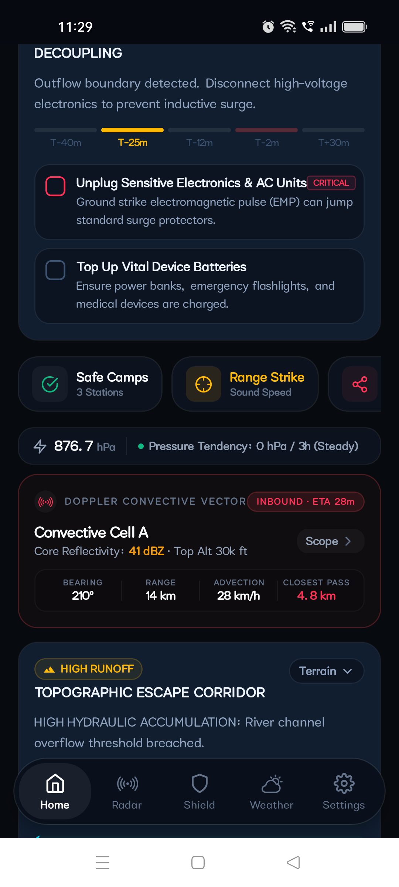
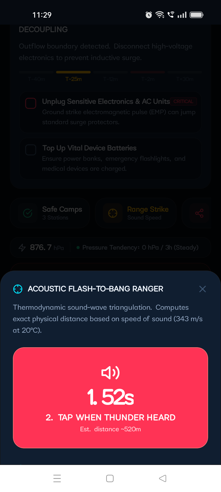
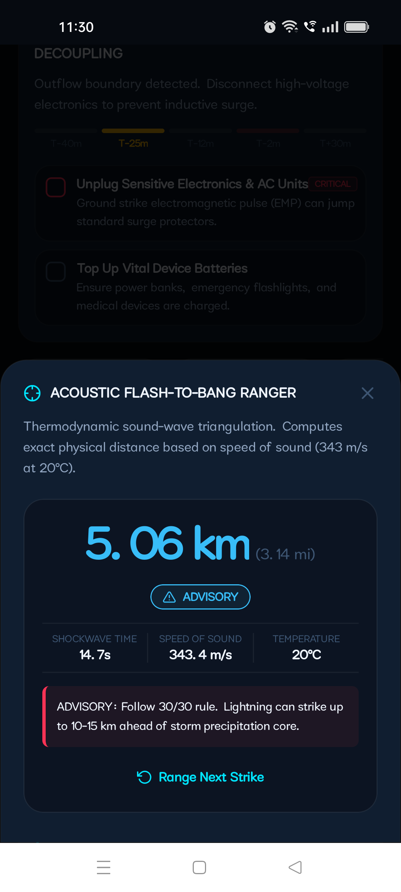
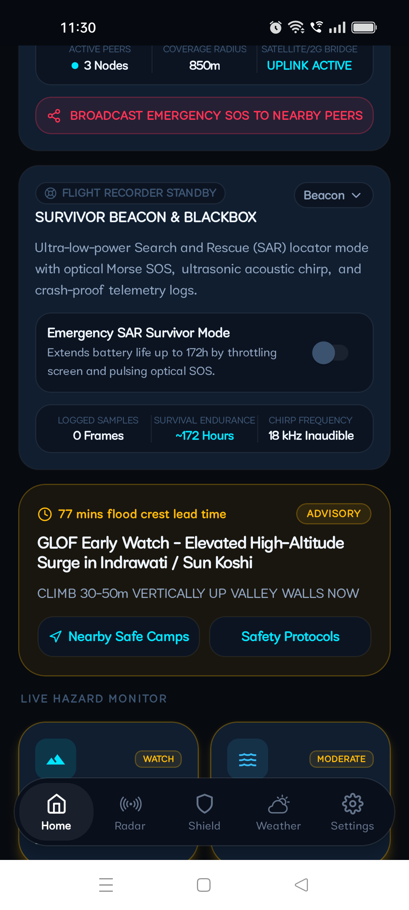
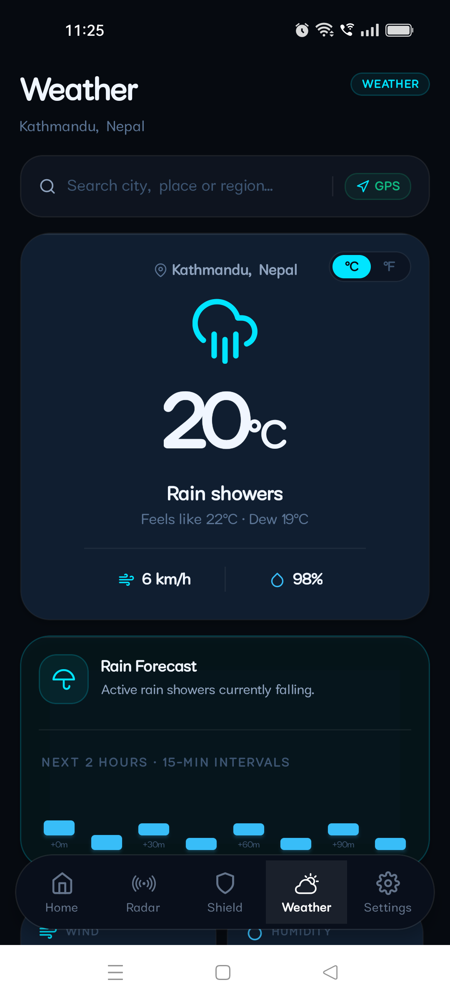
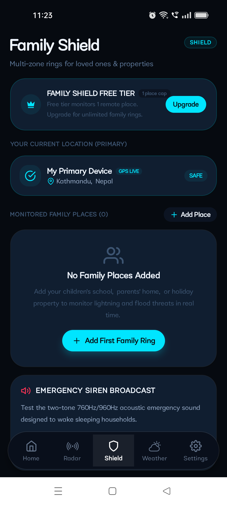
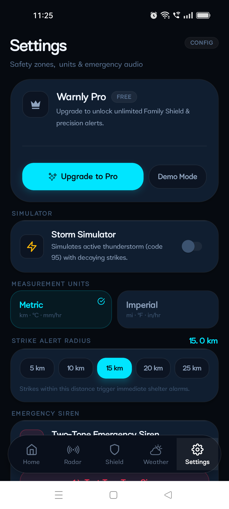

# Warnly

<div align="center">

### **Tier-1 Convective Storm & Tactical Emergency Defense System**

[](https://github.com/krishivjoshi219-collab/Warnly)
[-61DAFB?style=for-the-badge&logo=react)](https://reactnative.dev)
[](https://www.typescriptlang.org/)
[](https://github.com/krishivjoshi219-collab/Warnly/actions)
[](LICENSE)

*A zero-infrastructure, hyper-local convective weather & multi-hazard defense console engineered for rapid tactical decision-making during severe lightning strikes, convective supercells, flash floods, GLOFs, and seismic events.*

</div>

---

## Overview

Most commercial weather applications deliver broad, county-level forecasts hours after conditions have already degraded. **Warnly** is engineered for immediate, hyper-local survivability. It operates as a tactical emergency console that continuously analyzes atmospheric thermodynamics, sound-wave acoustics, radar advection vectors, and terrain topography to compute **exact physical proximity, impact lead times, and high-ground escape routes**.

Built with an **offline-first resilience architecture**, Warnly features ad-hoc BLE mesh communications, an automated 120-frame flight recorder blackbox, thermodynamic sound-wave triangulation, and synthesized emergency siren acoustics that function when cellular infrastructure collapses.

---

## Live Hardware Gallery (Physical Device Captures)

All screenshots below were captured live on a physical Android test device running the production APK compiled via GitHub Actions.

<div align="center">

| Home Tactical Console | Doppler Radar & Ridge Waypoint | Tactical Timeline & Action Strip |
| :---: | :---: | :---: |
|  |  |  |
| *Atmospheric threat assessment, CAPE index, Lifted Index, and live T-25m electrical decoupling phase.* | *Geodesic radar scope with 10km/15km range rings, convective cell advection vectors, and +95m ridge escape target.* | *Refined tactical action strip, barometric tendency (Steady 876 hPa), and Doppler cell ETA telemetry.* |

<br/>

| Acoustic Ranger (Active Timer) | Acoustic Ranger (30/30 Result) | WhisperMesh & SAR Blackbox |
| :---: | :---: | :---: |
|  |  |  |
| *Millisecond dual-tap sound wave triangulation timer computing real-time acoustic shockwave propagation.* | *Thermodynamic distance calculation (5.06 km @ 343.4 m/s) with 30/30 safety advisory classification.* | *Zero-infrastructure BLE mesh SOS trigger, 172h endurance SAR survivor mode, and GLOF valley warning.* |

<br/>

| Weather & Precipitation Forecast | Multi-Zone Family Shield | Settings & Defense Config |
| :---: | :---: | :---: |
|  |  |  |
| *15-minute interval rain forecast graph, atmospheric dew point, wind speed, and humidity indicators.* | *Multi-perimeter monitoring rings for loved ones, GPS live location status, and emergency siren trigger.* | *Adjustable alert radius dials (5km–25km), metric/imperial switches, and built-in convective storm simulator.* |

</div>

---

## 5 Killer Defense Engines

Warnly introduces five proprietary offline-capable modules engineered for extreme weather resilience:

### 1. Acoustic Flash-to-Bang Ranger (`src/lib/warnly/acoustic-ranger.ts`)
- **Thermodynamic Speed of Sound**: Computes sound wave speed dynamically using ambient temperature:
  $$v_s = 331.3 + (0.606 \times T_{^{\circ}\text{C}}) \quad [\text{m/s}]$$
- **Tactile Two-Tap Triangulation**: Tap on visible lightning flash to start the high-precision millisecond stopwatch; tap on thunder clap to lock the distance:
  $$d = v_s \times \Delta t$$
- **30/30 Safety Protocol Classification**:
  - `CRITICAL (< 2 km)`: Direct strike zone. High probability of ground-current flashover. Take hard shelter immediately.
  - `WARNING (2 – 6 km)`: Severe threat corridor. Atmospheric ionization detected.
  - `ADVISORY (6 – 15 km)`: Convective perimeter. Lightning can strike up to 15 km ahead of the rain core ("bolt from the blue").

### 2. WhisperMesh Zero-Infrastructure Mesh (`src/lib/warnly/whisper-mesh.ts`)
- **Ad-Hoc Bluetooth Low Energy Relay**: Operates store-and-forward peer-to-peer packet routing when all telecommunication cell towers and electrical grids fail.
- **Multi-Hop Propagation**: Broadcasts compressed emergency packets (under 100 bytes) across up to 5 intermediate hops to find an active uplink node.
- **Satellite & 2G Bridge Relaying**: Periodically pings low-bandwidth 2G cellular SMS or satellite bridge gateways to transmit distress coordinates ($lat/lng$, blood group, battery level).

### 3. Topographic Hydraulic Flood Escape Corridor (`src/lib/warnly/topographic-escape.ts`)
- **Valley Runoff Analysis**: Detects flash flood and Glacial Lake Outburst Flood (GLOF) catchment breaches.
- **Perpendicular Escape Vectoring**: Rather than following the flow of the valley floor, Warnly computes high-ground ridge escape azimuths ($042^{\circ}\text{ NE}$) and minimum vertical climb targets ($+95\text{m}$ elevation gain).
- **Ascent Timing**: Computes required evacuation pace relative to hydrological surge wave crest arrival times.

### 4. Disaster Blackbox & SAR Survivor Mode (`src/lib/warnly/disaster-blackbox.ts`)
- **120-Frame Circular Telemetry Recorder**: Logs a crash-proof rolling circular buffer containing barometric pressure, GPS velocity, battery level, and electromagnetic strike detections.
- **172-Hour Search-and-Rescue (SAR) Mode**: Throttles screen refresh and power draw to maximize battery longevity up to 172 hours.
- **Optical & Ultrasonic Distress Beacons**:
  - Optical camera flash pulsing standard Morse Code SOS (`... --- ...`).
  - High-frequency 18 kHz inaudible acoustic chirp optimized for canine search units and microphone-equipped rescue drones.

### 5. Pre-Impact Tactical Action Timeline (`src/lib/warnly/tactical-timeline.ts`)
- **Doppler-Synchronized Phase Countdowns**: Dynamic survival timeline linked directly to Doppler cell advection ETA:
  - **T - 40 min (Atmospheric Charging)**: Secure loose outdoor structures and verify water filtration reserves.
  - **T - 25 min (Electrical Decoupling)**: Outflow boundary arrival. Disconnect high-voltage AC electronics and solar invertors to prevent inductive EMP surge damage.
  - **T - 12 min (Core Inbound)**: Move livestock and vehicles into covered bays; retreat from exterior windows.
  - **T - 2 min (Precipitation Core & Downburst)**: Assume lightning crouch if caught outdoors; isolate from metallic plumbing and landlines.
  - **T + 30 min (30/30 Safety Lock)**: Mandatory holding period. Resets automatically upon every detected cloud-to-ground strike within 10 km.

---

## Meteorological Science & Atmospheric Telemetry

Warnly monitors real-time thermodynamic indices from WMO-compliant weather observation networks:

| Atmospheric Index | Healthy Baseline | Severe Warning Threshold | Physical Threat |
| :--- | :--- | :--- | :--- |
| **CAPE (Convective Available Potential Energy)** | $< 500\text{ J/kg}$ | $> 2,000\text{ J/kg}$ | Rapid updrafts, severe hail, and destructive microbursts |
| **Lifted Index (LI)** | $> 0\text{ K}$ | $< -3\text{ K}$ | Extreme atmospheric buoyancy and thunderstorm genesis |
| **Barometric Tendency ($\Delta P / 3\text{h}$)** | $\pm 0.5\text{ hPa}$ | $< -2.0\text{ hPa / 3h}$ | Rapid frontal passage, cyclonic deepening, squall line |
| **Radar Reflectivity (dBZ)** | $< 20\text{ dBZ}$ | $> 45\text{ dBZ}$ | Torrential cloudburst, severe hail core, extreme downburst |
| **P/S Seismic Separation** | $\Delta t > 0\text{ s}$ | $V_p \approx 6\text{ km/s}, V_s \approx 3.5\text{ km/s}$ | Provides 5 to 45 seconds of destructive S-wave advance lead time |

---

## Design System: Tier-1 Defense HUD

Warnly's user interface is built on a **defense-grade tactical design language**:
- **Zero-Emoji Architecture**: 100% custom-crafted native vector iconography (`Lucide-React-Native` & custom SVG vectors).
- **Obsidian Dark Palette**: Designed for OLED battery preservation during extended blackouts (`#070A0F` background, `#0C131F` card elevation).
- **High-Contrast Tactical Color Coding**:
  - `Emerald (#10B981)`: Operational status / all-clear envelope.
  - `Cyan (#00E5FF)`: Precision telemetry / radar sweep vectors.
  - `Amber (#F59E0B)`: Advisory / outflow boundary advance.
  - `Rose / Red (#EF4444)`: Critical threat / direct strike perimeter.
- **Tactile Accessibility**: High tap targets ($>48\text{dp}$), bold monospace telemetry counters, and high-readability status badges.

---

## Architecture & Project Structure

```
Warnly/
├── .github/
│   └── workflows/
│       └── build-apk.yml          # Automated cloud compilation & APK artifact workflow
├── android/                       # Native Android project (Gradle, Kotlin, Manifest)
│   ├── app/
│   │   ├── build.gradle           # Application namespace (com.warnly.convective)
│   │   └── src/main/
├── docs/
│   └── screenshots/               # High-resolution hardware screen captures
├── src/
│   ├── audio/                     # Synthesized 760Hz/960Hz dual-tone emergency siren
│   ├── components/
│   │   ├── Icons.tsx              # Pure native vector icon definitions (zero emojis)
│   │   ├── ui.tsx                 # Tactical GlassCard, GlowButton, FadeIn primitives
│   │   ├── GeodesicRadar.tsx      # Multi-ring radar sweep canvas & cell markers
│   │   ├── DynamicIsland.tsx      # Top threat pill & countdown bar
│   │   └── warnly/
│   │       ├── FlashToBangModal.tsx       # Acoustic sound wave ranger modal
│   │       ├── WhisperMeshCard.tsx        # BLE peer-to-peer mesh monitor
│   │       ├── TopographicEscapeCard.tsx  # Hydraulic flood escape azimuth HUD
│   │       ├── SurvivorBeaconCard.tsx     # Flight recorder blackbox & SAR beacon
│   │       ├── TacticalTimelineCard.tsx   # Pre-impact survival countdown checklist
│   │       ├── DopplerVectorCard.tsx      # Cell advection & barometric tendency card
│   │       ├── SafetyCampsModal.tsx       # Evacuation camp directory
│   │       └── GuideModal.tsx             # Mountain storm survival protocol manual
│   ├── lib/
│   │   └── warnly/
│   │       ├── acoustic-ranger.ts         # Speed-of-sound formula & 30/30 calculations
│   │       ├── whisper-mesh.ts            # BLE mesh node simulation & routing engine
│   │       ├── topographic-escape.ts      # Ridge pathfinding & runoff threshold math
│   │       ├── disaster-blackbox.ts       # 120-frame circular flight recorder
│   │       └── tactical-timeline.ts       # Doppler-synced survival action phases
│   ├── screens/
│   │   ├── HomeScreen.tsx         # Main tactical command center
│   │   ├── RadarScreen.tsx        # Geodesic multi-hazard radar scope
│   │   ├── ShieldScreen.tsx       # Family Shield multi-zone monitoring
│   │   ├── WeatherScreen.tsx      # Rain forecast & thermodynamic metrics
│   │   └── SettingsScreen.tsx     # Defense radius config & storm simulator
│   └── theme/
│       └── colors.ts              # Defense HUD color tokens & typography
├── package.json
└── tsconfig.json
```

---

## Cloud CI/CD: Automated APK Compilation

To preserve local CPU and RAM resources on development machines, Warnly utilizes a dedicated **GitHub Actions Cloud Build Pipeline** (`.github/workflows/build-apk.yml`):

1. **Trigger**: Pushes to `main` automatically initiate a clean Ubuntu runner with Java 17 and Android SDK 34.
2. **JavaScript Pre-bundling**: Executes `npx expo export:embed` to compile a production-ready, zero-latency Hermes bytecode bundle.
3. **Gradle Assembly**: Runs `./gradlew assembleDebug --no-daemon` with 4GB heap allocations.
4. **Artifact Upload**: Generates and stores `Warnly-React-Native-Mobile-APK` as a downloadable GitHub Actions artifact.

### Installing the Cloud Build via ADB

To deploy the compiled APK directly to a connected USB or Wi-Fi Android device:

```bash
# 1. Download the artifact from GitHub Actions
# 2. Extract the APK from the zip archive
unzip Warnly-React-Native-Mobile-APK.zip

# 3. Stream-install directly to your device
adb install -r app-debug.apk

# 4. Launch the Warnly Tactical Console
adb shell am start -n com.warnly.convective/.MainActivity
```

---

## Local Development & Web Preview

Warnly includes a dual-engine architecture supporting instant web preview via Vite:

### Web Preview Setup
```bash
# Install dependencies
npm install --legacy-peer-deps

# Start Vite live-reload development server
npm run dev
```
Navigate to `http://localhost:3000` to inspect responsive layout and interactive simulator controls.

### Typecheck & Linting
```bash
# Run TypeScript compiler checks
npm run build
```

---

## Hardware Sensor Integrations

- **Barometer (BAP)**: Monitors rapid millibar pressure drops indicating approaching squall lines.
- **Hardware Strobe Controller**: Directly drives the rear camera LED for optical distress signalling.
- **Do Not Disturb (DND) Audio Override**: Utilizes high-priority `STREAM_ALARM` audio channels to sound acoustic sirens even when the device is silenced.
- **High-Accuracy Geolocation**: Continually assesses proximity against the 10 km lightning radius and regional flash-flood catchments.

---

## License

Warnly is distributed under the **Apache License 2.0**. See the [LICENSE](LICENSE) file for more information.
