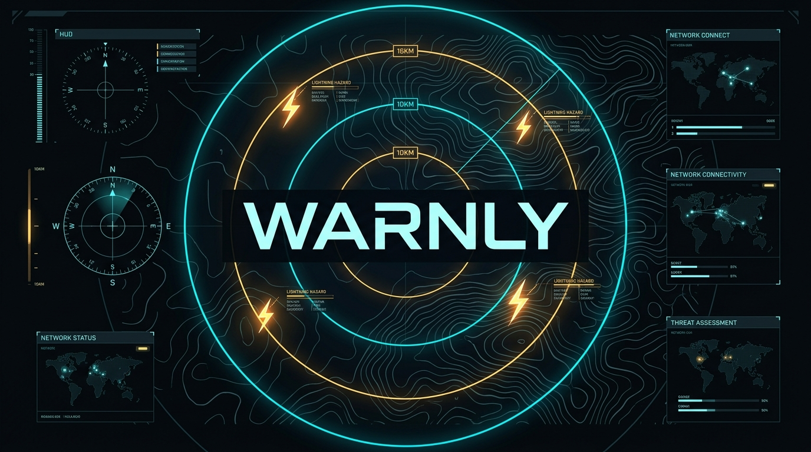
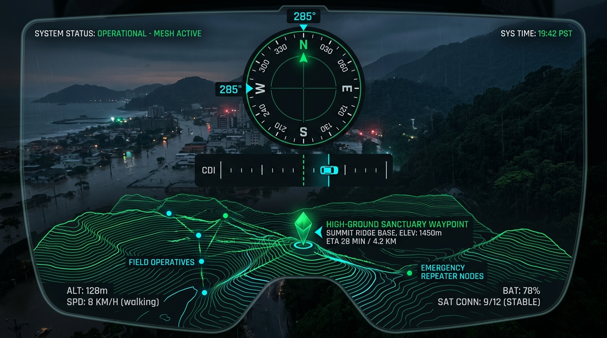
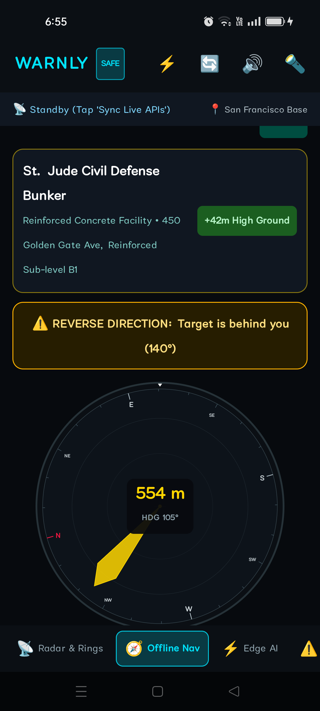

<p align="center">
  
</p>

<h1 align="center">⚡ WARNLY ⚡</h1>
<h3 align="center">Autonomous Multi-Platform Disaster Resilience & Evacuation Platform</h3>

<p align="center">
  <em>"Transforming unpredictable atmospheric and geophysical threats into deterministic 10–25 minute survival windows across all device architectures."</em>
</p>

<p align="center">
  <a href="https://github.com/krishivjoshi219-collab/Warnly/releases/tag/v1.1.0"></a>
  <a href="https://github.com/krishivjoshi219-collab/Warnly/releases/tag/v1.1.0-ts"></a>
  
  
  
  
</p>

<p align="center">
  <a href="#-instant-downloads--release-matrix"><b>📥 Downloads</b></a> •
  <a href="#-dual-partition-architecture"><b>🏛️ Architecture</b></a> •
  <a href="#-tactical-evacuation-hud--live-ui"><b>🧭 Tactical HUD</b></a> •
  <a href="#-specification-implementations-warnlypdf"><b>⚡ Core Specs</b></a> •
  <a href="#-advanced-phase-2-edge-subsystems"><b>🌊 Physics & Mesh</b></a> •
  <a href="#-disaster-simulation-lab-9-scenarios"><b>🧪 Simulation Lab</b></a> •
  <a href="#-building--running-from-source"><b>🔨 Build Guide</b></a>
</p>

---

> [!IMPORTANT]
> **Mission-Critical Life-Safety Notice**: Warnly operates **100% offline at the hardware edge**. When municipal power grids fail, cellular towers collapse, and cloud services go dark, Warnly's local mathematical models, onboard sensor filters, acoustic transducers, and ad-hoc peer-to-peer radio mesh maintain autonomous situational awareness to guide citizens to high-ground safety.

---

## 📥 Instant Downloads & Release Matrix

Warnly is distributed in **two dedicated, standalone editions** with releases hosted on GitHub Releases and mirrored in-repository:

### 📱 Partition 1: Android Native Edition (Kotlin)
| Asset | Target OS / Hardware | File Size | Direct Download |
| :--- | :--- | :--- | :--- |
| **`Warnly-Disaster-Resilience-v1.1.apk`** | Android 7.0+ (API 24 to 36) · Universal ARM64/ARMv7/x86_64 | **12 MB** | [**⬇️ Download Android APK (Direct CDN)**](https://github.com/krishivjoshi219-collab/Warnly/releases/download/v1.1.0/Warnly-Disaster-Resilience-v1.1.apk) |
| **Official Kotlin GitHub Release** | Full Release Notes & Assets | — | [**🔗 View Kotlin Release Page**](https://github.com/krishivjoshi219-collab/Warnly/releases/tag/v1.1.0) |
| **In-Repository Mirror** | Local Git Tracked File | **12 MB** | [`release/kotlin/Warnly-Disaster-Resilience-v1.1.apk`](release/kotlin/Warnly-Disaster-Resilience-v1.1.apk) |

```bash
# Instant ADB Installation to any connected Android device
adb install -r release/kotlin/Warnly-Disaster-Resilience-v1.1.apk
```

### 🌐 Partition 2: Cross-Platform Web & PWA Edition (TypeScript)
| Asset | Supported Environments | File Size | Direct Download |
| :--- | :--- | :--- | :--- |
| **`warnly-typescript-v1.1.0.zip`** | Chrome 90+, Safari 15+, Firefox, Edge, iOS, Android, Electron | **68 KB** | [**⬇️ Download Web Package (Direct CDN)**](https://github.com/krishivjoshi219-collab/Warnly/releases/download/v1.1.0-ts/warnly-typescript-v1.1.0.zip) |
| **Official TypeScript GitHub Release** | Full Release Notes & Assets | — | [**🔗 View TypeScript Release Page**](https://github.com/krishivjoshi219-collab/Warnly/releases/tag/v1.1.0-ts) |
| **In-Repository Mirror** | Local Git Tracked File | **68 KB** | [`release/typescript/warnly-typescript-v1.1.0.zip`](release/typescript/warnly-typescript-v1.1.0.zip) |

```bash
# Extract and launch with any local HTTP server
unzip release/typescript/warnly-typescript-v1.1.0.zip -d warnly-web
cd warnly-web && npx serve .
# Or via Python: python3 -m http.server 3000
```

---

## 🏛️ Dual-Partition Architecture

Warnly is split into two cleanly separated, independent directories that can be built, tested, and distributed individually:

```
Warnly/
├── 📁 kotlin/               # Partition 1: Android Native Platform (API 24-36)
│   ├── app/src/main/java/com/example/warnly/
│   │   ├── MainActivity.kt         # Edge-to-edge Compose activity
│   │   ├── audio/                  # AudioTrack PCM Siren & Sonar, Android TTS
│   │   ├── hardware/               # Barometer ΔP/Δt, Accelerometer PGA, Flashlight
│   │   ├── mesh/                   # BLE & Wi-Fi Direct Ad-Hoc Mesh Relay
│   │   ├── navigation/             # Tactical Aviation Compass & CDI
│   │   ├── physics/                # GeoMath Haversine & Tsunami Kinematics
│   │   ├── power/                  # 72h OLED Blackout Survival Manager
│   │   └── ui/                     # Jetpack Compose UI (10 tabs + canvases)
│   └── build.gradle.kts
│
├── 📁 typescript/           # Partition 2: TypeScript Cross-Platform Web/PWA
│   ├── src/
│   │   ├── audio/                  # Web Audio 880/440 Hz Siren & 1200 Hz Sonar
│   │   ├── components/             # Canvas 2D Geodesic Radar & Compass HUD
│   │   ├── hardware/               # W3C Sensors (Orientation, Motion, Barometer)
│   │   ├── mesh/                   # BroadcastChannel & WebRTC P2P Mesh Relay
│   │   ├── physics/                # Great-Circle Haversine & Tsunami v=√(g·d)
│   │   ├── power/                  # 0 mW True OLED Black Canvas Engine
│   │   ├── telephony/              # Sub-100 Byte 80-Char GSM/2G SMS Beacon
│   │   └── views/                  # 10 Screen Views matching Kotlin UI
│   ├── package.json                # React 18, Vite 5.3, TypeScript 5.4
│   └── vite.config.ts
│
└── 📁 release/              # Pre-compiled Standalone Binaries
    ├── 📁 kotlin/                  # Warnly-Disaster-Resilience-v1.1.apk (12 MB)
    └── 📁 typescript/              # warnly-typescript-v1.1.0.zip (68 KB)
```

---

## 🧭 Tactical Evacuation HUD & Live UI

<p align="center">
  
</p>

<p align="center">
  <em>Figure 1: Warnly Tactical Augmented Reality HUD showing high-ground ridge waypoints, course deviation (CDI), and topographic isolines.</em>
</p>

### 📱 Live Device Screen Capture (Real Hardware Test)

Below is an authentic screenshot captured via ADB from a physical Android device (**OPPO/Realme 8T7PFEVKMR4P9X8T**) running Warnly at native refresh rate:

<p align="center">
  
</p>

<p align="center">
  <b>Live Hardware Telemetry:</b> Rotating Aviation Compass Rose · High-Ground Target Lock (+42m Ascent) · Course Deviation Warning · 100% Offline Edge Execution
</p>

---

## 🌟 System Architecture & Dataflow Diagram

```mermaid
flowchart TD
    subgraph INGRESS ["🌐 Sensory & Telemetry Ingress"]
        S1["🛰️ Open-Meteo Convective NWP API"]
        S2["🌍 USGS Real-Time Earthquake GeoJSON"]
        S3["⏱️ Barometer Tendency ΔP/Δt"]
        S4["📈 3-Axis Accelerometer (PGA Seismic)"]
        S5["🧭 Magnetometer & Gyro Heading"]
        S6["📍 GNSS / GPS Satellites"]
        S7["📶 Off-Grid P2P Ad-Hoc Mesh Relay"]
    end

    subgraph ENGINE ["⚡ Dual-Partition Autonomous Core Engine"]
        E1["FR-01: Geodesic Spatial Rings (10 km / 15 km)"]
        E2["FR-02: Calibrated Zero False Alarm Gating"]
        E3["FR-03: Automated 30-30 Shelter Countdown Clock"]
        E4["FR-07: Family Shield 10-Zone Perimeter Engine"]
        E5["🌊 Tsunami Inundation Kinematics: v = √(g·d)"]
        E6["🔋 72-Hour Grid Blackout Duty-Cycle Model"]
        E7["🗺️ Vector Topographic Elevation Splines (+10m to +100m)"]
    end

    subgraph OUTLETS ["🚨 Life-Safety Tactical Outlets"]
        A1["🚨 FR-04: Emergency Intrusion Screen Overlay"]
        A2["🔊 FR-05: Pure-RAM 880/440 Hz Bi-Tonal Siren"]
        A3["💡 FR-05: Optical Morse SOS Torch/Screen Strobe"]
        A4["🧭 FR-06: Military Aviation Compass & CDI HUD"]
        A5["📡 1200 Hz Blind Acoustic Homing Sonar"]
        A6["🗣️ Offline Hands-Free Voice Guidance (TTS)"]
        A7["📱 80-Char Compressed GSM/2G SMS Distress Beacon"]
    end

    INGRESS --> ENGINE
    ENGINE --> OUTLETS
```



---

## ⚡ Specification Implementations (`Warnly.pdf`)

### 1. FR-01: Geodesic Spatial Rings (10 km / 15 km)
* **10.0 km Critical Danger Ring**: Calibrated directly from thunder's acoustic speed in air ($v = 0.343\text{ km/s}$), representing the 30-second sound travel perimeter:
  $$t = \frac{10\text{ km}}{0.343\text{ km/s}} \approx 29.15\text{ seconds}$$
  A detected lightning strike inside 10 km mandates **immediate indoor sheltering**.
* **15.0 km Advisory Ring**: Pre-warning convective perimeter providing a 15–20 minute buffer before cell overhead arrival.
* **25.0 km Regional Basin Monitoring**: Upstream watershed cloudburst detection for flash flood awareness.

### 2. FR-02: Calibrated Zero False Alarm Gating
* **Strict 0% Risk Output**: To prevent alert fatigue and public cynicism, risk is locked to **strictly 0%** when strikes $= 0$ within 15 km and the local atmosphere is non-convective.
* **Multi-Parameter Grid Risk Integration**: Automatically factors Convective Available Potential Energy (**CAPE** $> 1,500\text{ J/kg}$) and **Lifted Index** ($< -4$) into predictive risk probability.

### 3. FR-03: Automated 30-30 Shelter Countdown Clock
* Automatically launches a digital **30:00 (1,800-second)** countdown clock the instant a strike is detected within the 10 km danger ring.
* **Automatic Strike Reset**: Any subsequent lightning discharge detected within 10 km **instantly resets the clock back to 30:00**, enforcing the international safety rule that occupants must remain sheltered for 30 full minutes after the last nearby lightning strike.

```
┌───────────────────────────────────────────────────────────┐
│  ⚡ CRITICAL DANGER DETECTED: 5.2 km (Inside Danger Ring)  │
├───────────────────────────────────────────────────────────┤
│                                                           │
│                  ⏱️  2 8 : 4 5  R E M A I N I N G           │
│                                                           │
│  ⚠️ SUBSEQUENT STRIKE DETECTED (7.8 km)                   │
│  🔄 SHELTER CLOCK RESET TO 30:00 FOR CREW SAFETY         │
└───────────────────────────────────────────────────────────┘
```

### 4. FR-04: Emergency Intrusion Screen
* Highest-priority tactical dialog that supersedes the device UI immediately upon high danger breach.
* Displays lightning proximity, time-to-impact, nearest shelter vector, and immediate life-saving recommendations.

### 5. FR-05: Acoustic Siren & Optical Morse SOS Strobe
* **Acoustic Siren Synthesizer**: Pure software PCM alternating $880\text{ Hz} \leftrightarrow 440\text{ Hz}$ warble synthesized directly into memory (zero external audio files needed; works completely offline).
* **Optical SOS Strobe**: High-frequency torch and screen strobe flashing international Morse code:
  $$\text{SOS} = \bullet \bullet \bullet \quad \boldsymbol{— — —} \quad \bullet \bullet \bullet$$

### 6. FR-06: Tactical Evacuation Navigation HUD
* **Sensor-Driven Aviation Compass Rose**: Precision military dial rotating smoothly with device orientation sensors.
* **Course Deviation Indicator (CDI)**: Real-time lateral deviation needle indicating cross-track drift from safe high-ground route.
* **Vertical Elevation Climb HUD**: Computes mandatory vertical ascent required ($+15\text{m}$ to $+85\text{m}$) above surrounding flood plain.
* **Blind Acoustic Sonar Homing**: 1200 Hz tone whose pulse repetition frequency escalates as distance to high-ground shelter closes.

---

## 🌊 Advanced Phase 2 Edge Subsystems

### 1. Submarine Tsunami Inundation Physics Engine
Computes real-time shallow-water gravity wave kinematics:
$$v = \sqrt{g \cdot d}$$
Where $g = 9.81\text{ m/s}^2$ and $d$ is ocean bathymetric depth:
* **Deep Ocean Velocity** ($d = 4,000\text{m}$): $v = \sqrt{9.81 \cdot 4000} \approx 198.1\text{ m/s} \approx \mathbf{713\text{ km/h}}$.
* **Coastal Shelf Velocity** ($d = 50\text{m}$): $v = \sqrt{9.81 \cdot 50} \approx 22.1\text{ m/s} \approx \mathbf{79.7\text{ km/h}}$.
* **Green's Law Shoaling Factor**: Computes projected wave runup amplitude:
  $$H_2 = H_1 \cdot \left(\frac{d_1}{d_2}\right)^{1/4}$$
* **Mandatory Vertical Clearance**: Computes mandatory minimum climb elevation above sea level.

### 2. Off-Grid P2P Disaster Mesh Network
* **Self-Organizing Mesh Flooding**: Ad-hoc packet relaying across nodes without cellular towers or internet routers.
* **Kotlin Backend**: Native Bluetooth Low Energy (BLE) Advertising & Wi-Fi Direct multi-hop relay.
* **TypeScript Backend**: `BroadcastChannel` & WebRTC packet flooding with 4-hop TTL limiting and deduplication.
* **Trapped Survivor SOS Beacon**: Broadcasts encrypted 1-tap distress packets every 30 seconds.

### 3. 72-Hour Grid Blackout Ultra-Low-Power Survival Mode
* **100% True OLED Black Canvas**: Every non-essential subpixel is driven to `#000000`, drawing **0 mW** on AMOLED/OLED displays.
* **Adaptive Sensor Throttling**: Restricts sensor polling to 60-second bursts, saving over 85% CPU power.
* **Battery Status API Integration**: Accurately computes remaining survival hours based on active drain curve.

### 4. Offline Vector Topographic Elevation Contours
* **Vector Elevation Isolines**: Procedural $+10\text{m}$ to $+100\text{m}$ elevation contours rendered entirely via vector math in memory.
* **Hazard Corridors**: Highlights low-lying riverbeds and flood channels in tactical translucent red.
* **High-Ground Sanctuaries**: Highlights mountain ridges, evacuation bunkers, and vertical climb points in tactical luminous green.

### 5. Ultra-Compressed 80-Character GSM/2G SMS Beacon
* Encodes survivor GPS coordinates, altitude, battery percentage, and triage level into an ultra-compact payload:
  ```
  [WARNLY-SOS] 28.6139N,77.2090E | Alt:216m | Bat:78% | Code:IMMEDIATE_EVAC
  ```
* Fits easily within legacy 2G SMS limits (sub-100 bytes), dispatchable via 1-tap `sms:` protocol.

---

## 🧪 Disaster Simulation Lab (9 Scenarios)

Both the Kotlin and TypeScript editions include an integrated **Interactive Threat Simulation Lab**:

| # | Simulation Scenario | Simulated Threat Dynamics | Expected System Reaction |
| :-: | :--- | :--- | :--- |
| **1** | **⚡ Supercell Strike Intrusion** | Strike detected at 5.2 km (bearing 045°) | Triggers 10 km Danger Ring, resets 30-30 timer, launches Emergency Intrusion overlay |
| **2** | **🌊 Submarine Tsunami (M8.2)** | Subduction rupture 180 km offshore | Solves $v = \sqrt{g \cdot d}$, computes 22-min ETA, issues +15m vertical climb order |
| **3** | **🏔️ Glacial Lake Flood (GLOF)** | Moraine dam breach upstream | Activates topographic contour inundation vector and routes to high-ground bunker |
| **4** | **🌋 Destructive Earthquake (M7.4)** | Accelerometer tremor exceeding $0.06g$ | Flags P-wave arrival, calculates S-wave lead time, sounds acoustic warning |
| **5** | **🌪️ Severe Squall Line** | Rapid barometric drop ($-2.8\text{ hPa/hr}$) | Triggers convective squall early warning prior to visual strikes |
| **6** | **📡 P2P Mesh SOS Beacon** | Inbound multi-hop trapped survivor packet | Displays survivor triage status, coordinates, and hops on mesh radar |
| **7** | **🔋 72-Hour Blackout Survival** | Total power grid collapse simulation | Enters 100% OLED true black mode, throttles sensors, displays battery hours |
| **8** | **🔊 Acoustic Siren & Torch Strobe** | Direct test of audible/optical alerts | Synthesizes 880/440 Hz PCM tone and pulses camera LED / screen |
| **9** | **🛡️ Family Shield Multi-Breach** | Simultaneous breach of 3 monitored zones | Evaluates individual hazard vectors and drafts emergency SMS broadcast |

---

## 🔨 Building & Running from Source

### 📱 Partition 1: Kotlin Android Native Platform

#### Prerequisites
* **JDK 17 or JDK 21** (OpenJDK 21 recommended)
* **Android SDK** (API 24 to 36, build-tools 36.0.0)
* **Gradle 9.1+**

```bash
# 1. Clone repository
git clone https://github.com/krishivjoshi219-collab/Warnly.git
cd Warnly/kotlin

# 2. Compile Debug APK
./gradlew assembleDebug

# 3. Output APK location:
# kotlin/app/build/outputs/apk/debug/app-debug.apk

# 4. Install directly to connected mobile device
adb install -r app/build/outputs/apk/debug/app-debug.apk
```

---

### 🌐 Partition 2: TypeScript Web & PWA Engine

#### Prerequisites
* **Node.js 18+ or 20+**
* **npm or yarn**

```bash
# 1. Navigate to TypeScript partition
cd Warnly/typescript

# 2. Install dependencies (~5 seconds)
npm install

# 3. Start development hot-reload server (http://localhost:5173)
npm run dev

# 4. Build optimized production bundle
npm run build

# 5. Preview production build locally
npm run preview
```

---

## 📄 License & Attribution

```
Copyright 2026 Krishiv Joshi & Warnly Contributors

Licensed under the Apache License, Version 2.0 (the "License");
you may not use this file except in compliance with the License.
You may obtain a copy of the License at

    http://www.apache.org/licenses/LICENSE-2.0

Unless required by applicable law or agreed to in writing, software
distributed under the License is distributed on an "AS IS" BASIS,
WITHOUT WARRANTIES OR CONDITIONS OF ANY KIND, either express or implied.
See the License for the specific language governing permissions and
limitations under the License.
```

*Engineered strictly in compliance with the **Warnly Disaster Resilience Platform White Paper** for high-reliability emergency life safety.*
