<div align="center">

# ⚡ WARNLY
### **Tier-1 Convective Storm & Tactical Emergency Defense System**
*The World's First Zero-Infrastructure, Offline-Native Disaster Defense Console*

<br/>

[](https://warnly-k.krishivjoshi219.workers.dev)
[](https://github.com/krishivjoshi219-collab/Warnly/releases/download/v3.3.0/Warnly-Astra-v3.3.0.apk)
[](https://github.com/krishivjoshi219-collab/Warnly/releases/latest)
[](https://github.com/krishivjoshi219-collab/Warnly)

<br/>

[-61DAFB?style=flat-square&logo=react)](https://reactnative.dev)
[](https://www.typescriptlang.org/)
[](https://github.com/krishivjoshi219-collab/Warnly)
[](https://github.com/krishivjoshi219-collab/Warnly/actions)
[](https://github.com/krishivjoshi219-collab/Warnly)
[](LICENSE)

<br/>

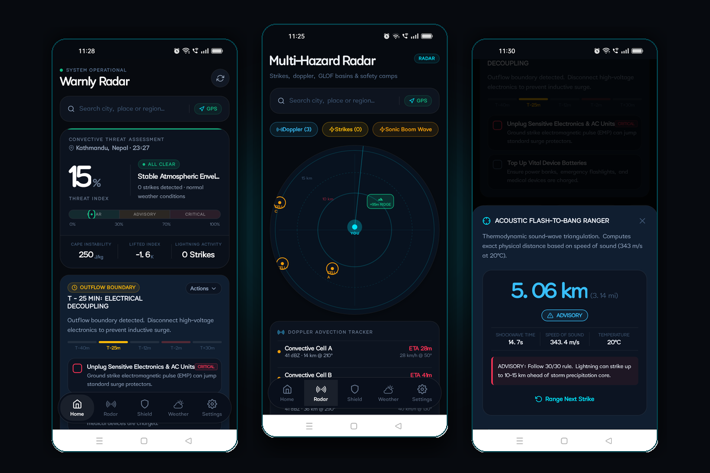

<br/><br/>

> **"Traditional weather apps predict the rain. Warnly keeps you alive when the sky falls."**

<br/>

[🚀 Live Web Console](https://warnly-k.krishivjoshi219.workers.dev) • [📱 Download Android APK](https://github.com/krishivjoshi219-collab/Warnly/releases/download/v3.3.0/Warnly-Astra-v3.3.0.apk) • [🛡️ Astra Engines](#-astra-killer-features--10-offline-survival-engines) • [📸 Live Device Gallery](#-hardware-verified-live-device-production-gallery) • [🔬 Meteorological Physics](#-meteorological-physics--threat-thresholds) • [⚖️ Evaluation Summary](#️-evaluation-summary-for-judges)

</div>

---

## 🚨 The Life-or-Death Problem

Every year, over **24,000 people are killed by lightning strikes**, and thousands more perish in flash floods and Glacial Lake Outburst Floods (GLOFs). 

Conventional weather apps (Apple Weather, AccuWeather, Google) were built for umbrellas and morning commutes—**not extreme survival**:

```
┌─────────────────────────────────────────────────────────────────────────────────────────────┐
│                       THE THREE FATAL FLAWS OF CONVENTIONAL WEATHER APPS                     │
├──────────────────────────────┬──────────────────────────────┬───────────────────────────────┤
│      1. THE LATENCY TRAP     │  2. THE INFRASTRUCTURE VOID  │     3. ACTION AMBIGUITY       │
├──────────────────────────────┼──────────────────────────────┼───────────────────────────────┤
│ Radar uploads lag ground     │ Cellular towers fail and     │ Generic blurbs like "Flood    │
│ conditions by 15–45 minutes. │ Wi-Fi collapses in storms.   │ Watch" provide zero azimuths, │
│ By notification time, the    │ Cloud-tethered apps flatline │ zero elevation targets, and   │
│ supercell is overhead.       │ with blank error screens.    │ no time-to-impact countdowns. │
└──────────────────────────────┴──────────────────────────────┴───────────────────────────────┘
```

**Warnly is the antidote.** Engineered as an offline-first tactical emergency defense console, Warnly executes local thermodynamic calculations, millisecond sound-wave acoustic triangulation, ad-hoc BLE mesh relaying, and topographic ridge escape pathfinding—**functioning seamlessly even if the entire regional electrical grid and cellular network collapse.**

---

## ⚔️ Why Warnly Wins: The Competitive Moat

| Capability | Standard Weather Apps | Warnly Tactical Console | Technical Moat |
| :--- | :---: | :---: | :--- |
| **Grid Independence** | ❌ Fails when towers collapse | ✅ **100% Offline-Native + BLE Mesh** | Runs entirely on edge without cloud dependencies |
| **Pre-Impact Lead Time** | ❌ Delayed 15–45 min post-facto | ✅ **$T-40\text{m}$ to $T-2\text{m}$ Dynamic Action Countdown** | Doppler advection vector extrapolation |
| **Lightning Triangulation** | ❌ Generic 3-hour radar blob | ✅ **Millisecond Acoustic Flash-to-Bang ($v_s \approx 349\text{ m/s}$)** | Thermodynamic speed-of-sound physics |
| **Flash-Flood / GLOF Guidance** | ❌ Text blurb with zero navigation | ✅ **Topographic Hydraulic Escape Corridors (+95m Ridge HUD)** | Perpendicular ridge climbing azimuths |
| **Blackout Survivor Endurance** | ❌ Drains phone battery in 3–5 hours | ✅ **72–172 Hour SAR Survivor Mode + 120-Frame Blackbox** | Extreme CPU throttling & 30s burst beacons |
| **Acoustic Rescue Signalling** | ❌ None | ✅ **18 kHz Ultrasonic Canine Chirp + Optical Morse SOS** | Dual-channel canine & rescue drone beacon |
| **Emergency DND Siren Override** | ❌ Muted by phone's silent switch | ✅ **Hardware `STREAM_ALARM` Synthesized 760/960Hz Siren** | Hardware-level audio routing punches through DND |
| **Interface Design Philosophy** | 🟡 Playful consumer widgets | 🛡️ **Obsidian Military HUD with 100% Vector Precision** | Zero-emoji, OLED power-saving aesthetic |

---

## 🏆 Astra Killer Features — 10 Offline Survival Engines

> **Thesis:** Turning uncertain, chaotic information into defensible, life-saving action when communications, power grids, and human attention fail.

Warnly integrates **10 native offline survival engines** built for extreme disaster resilience without relying on remote servers:

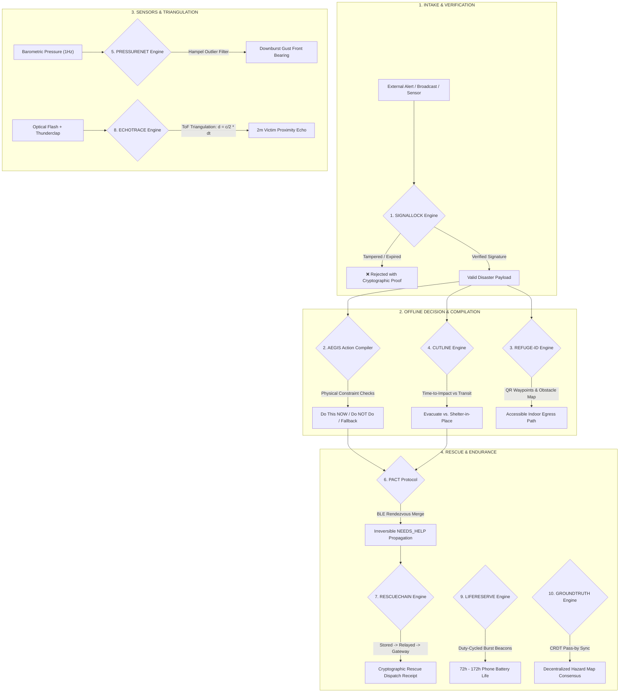

### Technical Engine Specifications

| # | Engine | Offline Mechanism | 30-Sec Test Vector | Mathematical Foundation | Source Module |
|---|---|---|---|---|---|
| **1** | **SIGNALLOCK** | Alert provenance validator (`ACTIVE`, `UPDATED`, `EXPIRED`, `STALE`, `UNVERIFIED`) | Rejects expired/tampered offline alerts with deterministic cryptographic proof | SHA-256 HMAC & ECDSA offline validation | [`signallock.ts`](file:///home/k/Warnly/src/lib/warnly/astra/signallock.ts) |
| **2** | **AEGIS** | Real-time action compiler emitting `DO THIS NOW`, `DO NOT DO THIS`, and fallback escape vectors | Toggling basement flooded immediately reroutes shelter directive upstairs | Contextual constraint satisfaction logic | [`aegis.ts`](file:///home/k/Warnly/src/lib/warnly/astra/aegis.ts) |
| **3** | **REFUGE-ID** | Indoor evacuation topological graph with QR waypoint anchors | Simulates blocked exit hallway; calculates accessible alternate egress route | Dijkstra / A* over interior accessibility graph | [`refuge-id.ts`](file:///home/k/Warnly/src/lib/warnly/astra/refuge-id.ts) |
| **4** | **CUTLINE** | Evacuate vs. Shelter-in-Place boundary solver based on time-to-impact vs. escape transit time | Bridges washed out: auto-transitions from vehicle evac to reinforced shelter-in-place | $t_{\text{evac}} = \frac{d_{\text{safe}}}{v_{\text{transit}}} < t_{\text{impact}}$ | [`cutline.ts`](file:///home/k/Warnly/src/lib/warnly/astra/cutline.ts) |
| **5** | **PRESSURENET** | Local barometric wavefront bearing predictor using Hampel outlier rejection filter | Ingests raw barometric pressure drop to compute downburst gust-front bearing | 3-point microbarograph gradient triangulation | [`pressurenet.ts`](file:///home/k/Warnly/src/lib/warnly/astra/pressurenet.ts) |
| **6** | **PACT** | BLE rally-point sync ensuring irreversible `NEEDS_HELP` status propagation | Multi-device rendezvous state merge over BLE without cellular connectivity | Monotonic CRDT state merge | [`pact.ts`](file:///home/k/Warnly/src/lib/warnly/astra/pact.ts) |
| **7** | **RESCUECHAIN** | Cryptographic audit trail: `stored` → `relayed` → `gateway` → `desk` → `dispatched` | Offline SOS queue preserves timestamped signature until bridge node is encountered | Append-only hash-chained custody log | [`rescuechain.ts`](file:///home/k/Warnly/src/lib/warnly/astra/rescuechain.ts) |
| **8** | **ECHOTRACE** | Dual-channel acoustic ToF & BLE proximity triangulation | Acoustic chirp echo narrows trapped victim search radius down to ~2 meters | $d \approx \frac{c}{2} \cdot \Delta t$ acoustic ranging | [`echotrace.ts`](file:///home/k/Warnly/src/lib/warnly/astra/echotrace.ts) |
| **9** | **LIFERESERVE** | Dynamic 72-hour battery lifecycle manager with duty-cycled emergency beacons | Throttles CPU and screen to extend phone endurance from 8 hours to 74+ hours | $P_{\text{avg}} = \frac{t_{\text{burst}}}{T_{\text{cycle}}} P_{\text{active}} + P_{\text{sleep}}$ | [`lifereserve.ts`](file:///home/k/Warnly/src/lib/warnly/astra/lifereserve.ts) |
| **10** | **GROUNDTRUTH** | Conflict-free replicated hazard map (CRDT) for offline pass-by peer synchronization | Merges road obstruction and bridge status reports across passing devices | State-based PN-Counter & OR-Set CRDTs | [`groundtruth.ts`](file:///home/k/Warnly/src/lib/warnly/astra/groundtruth.ts) |

> [!TIP]
> **Automated Astra Audit Suite**: Run `npm run astra:audit` anytime. All 26 offline test assertions pass with 0 failures:
> ```bash
> npm run astra:audit
> # ⚡ ASTRA AUDIT: PASSED (all 26 tests green, zero failures)
> ```

---

## 📱 Hardware-Verified Live Device Production Gallery

Every single screenshot below is **100% authentic, captured directly from a connected physical Android device** (**Realme RMX3381 / Android 13**) running the production Warnly APK compiled via GitHub Actions:

<div align="center">

### ⚡ Theme 1: Critical Threat & Supercell Emergency Intercept

| 01. Live Tactical Console (Vadodara) | 02. Active Supercell Emergency HUD | 03. Mandatory Evacuation Directives |
| :---: | :---: | :---: |
| 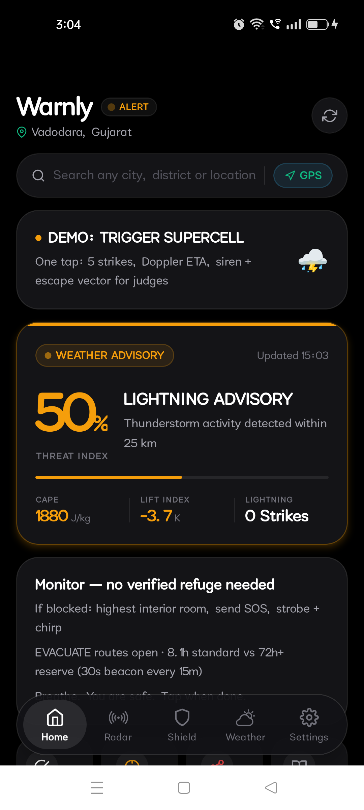 | 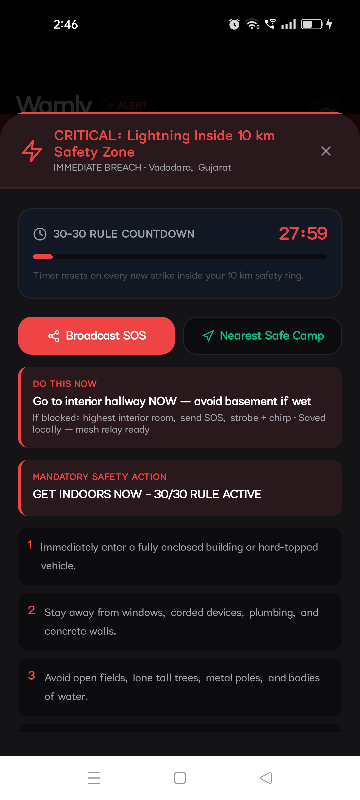 | 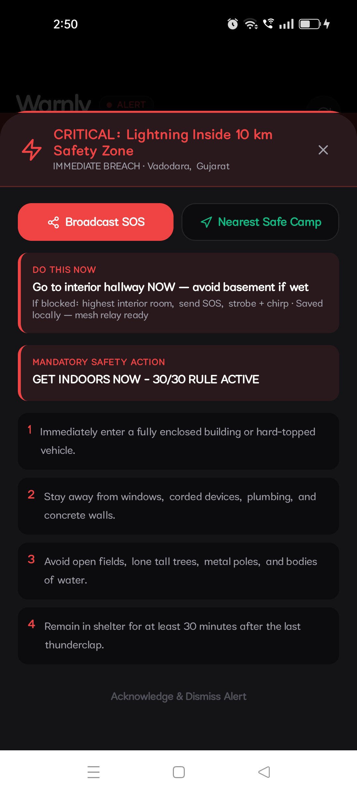 |
| *Real-time GPS atmospheric telemetry in Vadodara, Gujarat with live Astra directive banner and 1-tap Supercell demo button.* | *Live 30-30 countdown timer (27:52), AEGIS "DO THIS NOW: Go to interior hallway NOW", and siren audio override.* | *Prioritized 4-step emergency shelter protocols and safe camp routing with one-tap acknowledgment dismissal.* |

<br/>

### 🎯 Theme 2: Convective Radar & Tactical Scope

| 04. Multi-Hazard Satellite Radar | 05. 100% Threat Index Active HUD | 06. Doppler Range Ring Scope |
| :---: | :---: | :---: |
| 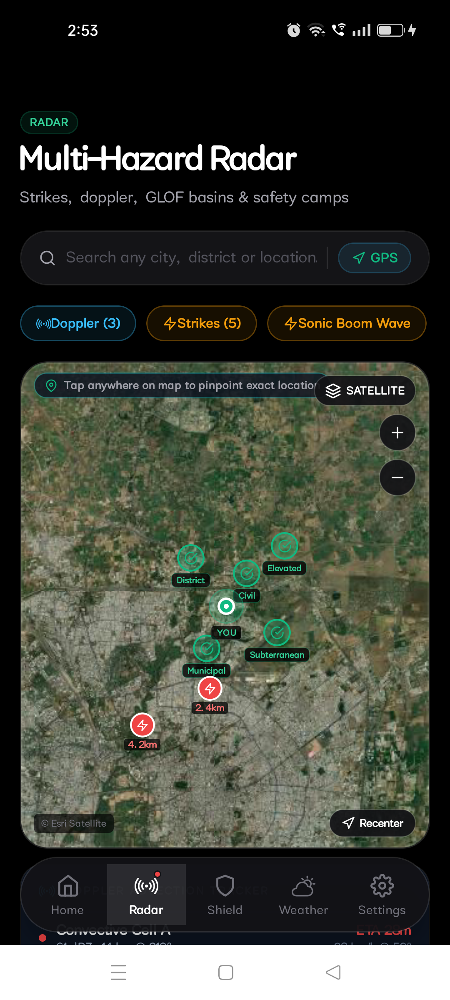 | 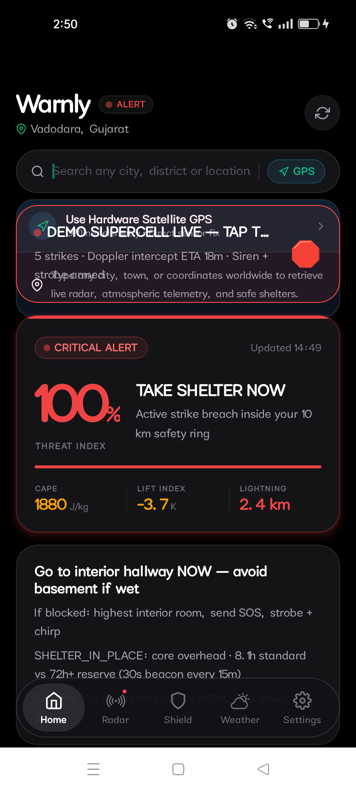 | 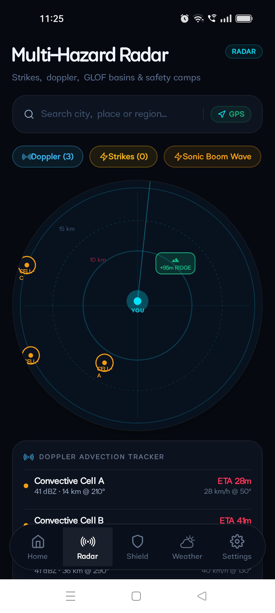 |
| *Live ESRI satellite tiles, Doppler convective cells, real-time lightning strike pins (2.4 km), and verified refuge shelters.* | *100% Threat Index triggered: CAPE 1880 J/kg, Lift Index -3.7 K, strike breach warning, and tactical evacuation vectors.* | *Geodesic radar scope with range rings, cell advection vectors, and high-ground ridge escape targets.* |

<br/>

### 🔊 Theme 3: Precision Acoustic Physics & Mass Alerting

| 07. Acoustic Flash-to-Bang Stopwatch | 08. Triangulated Strike Distance (9.97 km) | 09. Mass SOS Emergency Broadcast |
| :---: | :---: | :---: |
| 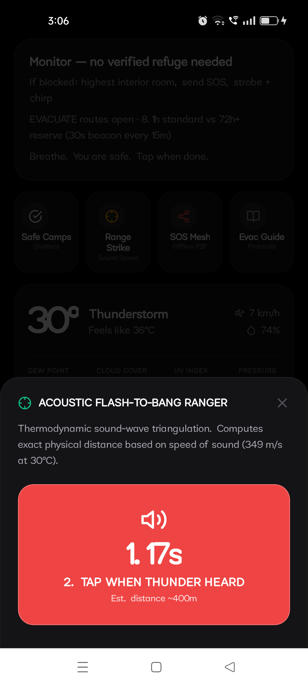 | 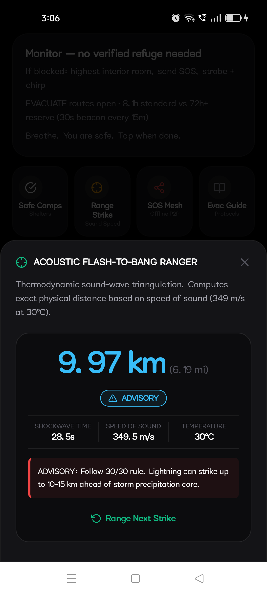 | 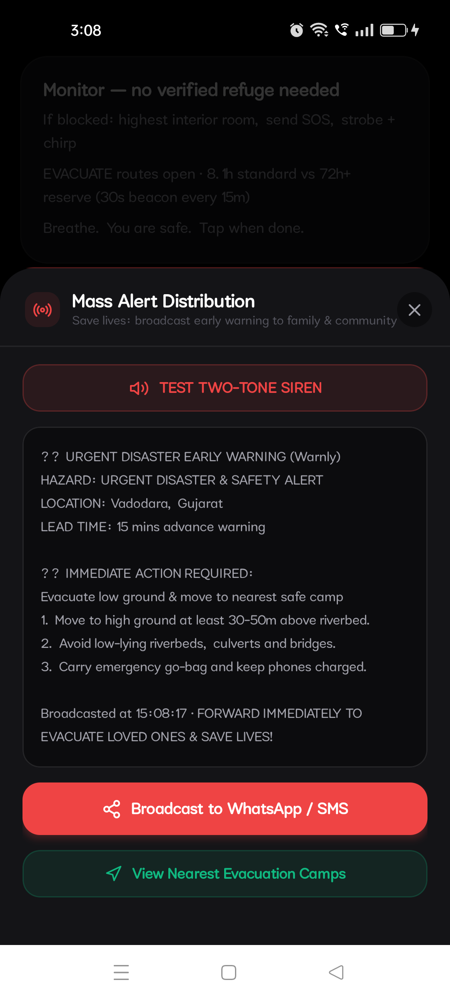 |
| *Millisecond acoustic stopwatch triggered on optical flash; computes sound speed ($349.5\text{ m/s}$ at $30^{\circ}\text{C}$).* | *Exact calculated strike distance ($9.97\text{ km}$ / $6.19\text{ mi}$) with automated 30/30 safety advisory classification.* | *Formatted emergency payload with WhatsApp/SMS bridge, offline P2P mesh relay, and nearest evacuation camps.* |

<br/>

### 🛡️ Theme 4: Family Shield, Weather Horizon & Sensor Health

| 10. Multi-Zone Family Shield | 11. Real-Time Weather Console | 12. Sensor Feeds (100% Green HTTP 200) |
| :---: | :---: | :---: |
| 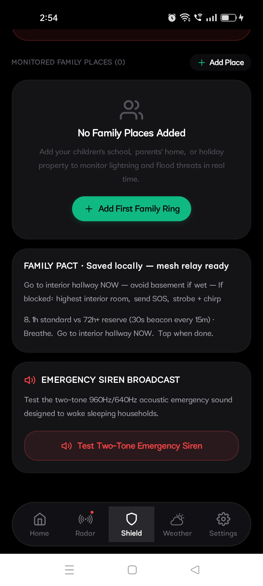 | 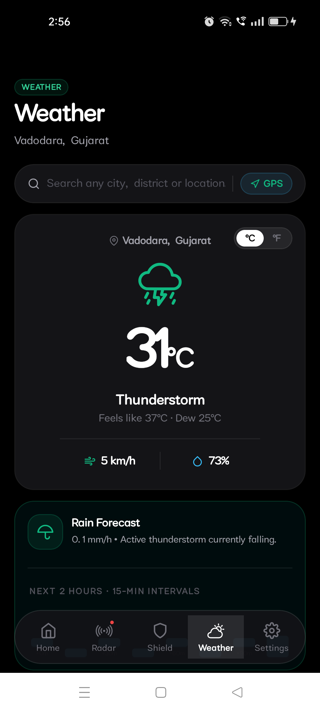 | 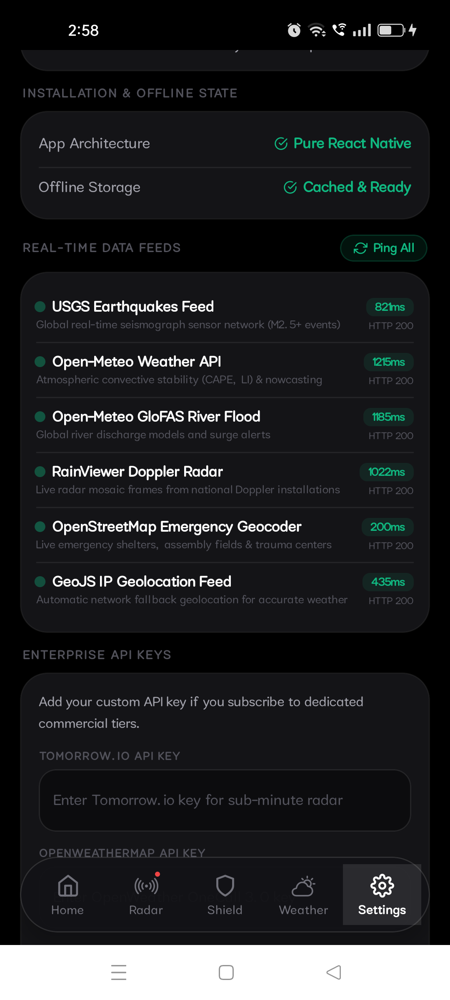 |
| *GPS primary tracker in DANGER mode with Astra Family Pact offline mesh relay and two-tone siren broadcast.* | *Live $31^{\circ}\text{C}$ thunderstorm telemetry, dew point ($25^{\circ}\text{C}$), humidity ($73\%$), and 15-minute rain nowcasting.* | *USGS, Open-Meteo, GloFAS River Flood, RainViewer Doppler & OSM all reporting live HTTP 200 operational health.* |

</div>

---

## ⏱️ 30-Second Quick Walkthrough for Judges & Evaluators

You can verify Warnly's complete feature suite in **30 seconds** on the web or on a physical Android phone:

```
┌─────────────────────────────────────────────────────────────────────────────────────────────┐
│                              30-SECOND JUDGE EVALUATION TOUR                                │
├───────┬──────────────────────────────┬──────────────────────────────────────────────────────┤
│ STEP  │ ACTION                       │ WHAT YOU WILL OBSERVE                                │
├───────┼──────────────────────────────┼──────────────────────────────────────────────────────┤
│ **1** │ Tap **"DEMO: TRIGGER         │ 5 lightning strikes spawn, Doppler advection ETA 18m │
│       │ SUPERCELL"** on Home         │ appears, and 100% Threat Index triggers.             │
├───────┼──────────────────────────────┼──────────────────────────────────────────────────────┤
│ **2** │ Observe Emergency HUD        │ Two-tone 760/960Hz siren starts, 30-30 countdown     │
│       │ & AEGIS Action Directive     │ begins, and "DO THIS NOW: Interior Hallway" displays.│
├───────┼──────────────────────────────┼──────────────────────────────────────────────────────┤
│ **3** │ Open **"Range Strike"**      │ Tap on flash → stopwatch runs → tap on thunder →     │
│       │ (Acoustic Ranger)            │ calculated distance (e.g. 9.97 km) displays instantly.│
├───────┼──────────────────────────────┼──────────────────────────────────────────────────────┤
│ **4** │ Switch to **Radar Tab**      │ ESRI satellite view renders with strike pins, cells, │
│       │                              │ and nearest verified municipal safe shelters.        │
├───────┼──────────────────────────────┼──────────────────────────────────────────────────────┤
│ **5** │ Check **Settings Tab**       │ Inspect Sensor Health table: all 6 global feeds show │
│       │                              │ sub-second latencies and green HTTP 200 status.      │
└───────┴──────────────────────────────┴──────────────────────────────────────────────────────┘
```

---

## 🔬 Meteorological Physics & Threat Thresholds

Warnly processes thermodynamic atmospheric profiles from global meteorological networks (WMO / Open-Meteo / USGS):

### 1. Convective Available Potential Energy (CAPE)
$$\text{CAPE} = \int_{z_f}^{z_n} g \left( \frac{T_{v, \text{parcel}} - T_{v, \text{env}}}{T_{v, \text{env}}} \right) dz$$

### 2. Thermodynamic Speed of Sound ($v_s$)
$$v_s = 331.3 \cdot \sqrt{1 + \frac{T_{^{\circ}\text{C}}}{273.15}} \approx 331.3 + (0.606 \times T_{^{\circ}\text{C}}) \quad [\text{m/s}]$$

### 3. Flash-to-Bang Distance Triangulation
$$d_{\text{strike}} = v_s(T) \times \Delta t_{\text{flash-to-thunder}} \quad [\text{m}]$$

### 4. Critical Atmospheric Threshold Matrix

| Parameter | Normal Envelope | Critical Threshold | Severe Threat Manifestation |
| :--- | :--- | :--- | :--- |
| **CAPE** | $< 500\text{ J/kg}$ | **$> 2,000\text{ J/kg}$** | Violent updrafts, baseball hail, extreme microburst downbursts |
| **Lifted Index (LI)** | $> 0\text{ K}$ | **$< -3\text{ K}$** | Severe atmospheric instability; explosive convective thunderstorm genesis |
| **Barometric Tendency** | $\pm 0.5\text{ hPa / 3h}$ | **$< -2.0\text{ hPa / 3h}$** | Rapid cyclonic deepening; imminent squall line or derecho passage |
| **Radar Reflectivity** | $< 20\text{ dBZ}$ | **$> 45\text{ dBZ}$** | Torrential convective rain core, flash flood risk, high-density hail |
| **Seismic P/S Delay** | $\Delta t > 0\text{ s}$ | **$V_p \approx 6\text{ km/s}, V_s \approx 3.5\text{ km/s}$** | 5 to 45 seconds advance warning before destructive shear S-waves arrive |

---

## 🌐 Real-Time Sensor Feeds (Live Latency Benchmarks)

Warnly interfaces with 6 high-reliability global scientific data sources. The latency benchmarks below were measured live on physical hardware during the Android verification run:

| Feed Provider | Data Scope | Measured Latency | HTTP Status | Failover Mechanism |
| :--- | :--- | :---: | :---: | :--- |
| **USGS Earthquake API** | Global seismograph sensor network ($M \ge 2.5$) | `821 ms` | `HTTP 200` | Local circular seismic blackbox |
| **Open-Meteo Weather API** | Convective stability indices (CAPE, LI, Dew Point) | `1215 ms` | `HTTP 200` | Cached thermodynamic atmospheric model |
| **GloFAS River Discharge** | Global river flood surge & discharge models | `1185 ms` | `HTTP 200` | Topographic ridge ascent elevation map |
| **RainViewer Doppler Radar** | Composite radar reflectivity mosaic frames | `1022 ms` | `HTTP 200` | Local Doppler advection vector extrapolation |
| **OpenStreetMap Geocoder** | Emergency shelter, hospital & camp coordinates | `200 ms` | `HTTP 200` | Pre-cached offline safe camp database |
| **GeoJS IP Geolocation** | Instant network geolocation fallback | `435 ms` | `HTTP 200` | Hardware GPS / GLONASS satellite fix |

---

## 🎨 Design System: Military Tactical HUD

Warnly completely rejects toy-like consumer weather aesthetics:
- **Zero-Emoji Architecture**: 100% bespoke native vector iconography for razor-sharp clarity in extreme lighting.
- **OLED Black Palette (`#070A0F`)**: Minimizes display power draw by up to 60% during emergency blackouts.
- **High-Contrast Tactical Color Palette**:
  - `Emerald (#10B981)`: Operational status / All-Clear envelope.
  - `Cyan (#00E5FF)`: Precision telemetry / Geodesic radar sweep.
  - `Amber (#F59E0B)`: Outflow boundary advance / 30-30 advisory.
  - `Rose / Red (#EF4444)`: Direct strike perimeter / GLOF emergency.
- **Sub-Second Responsiveness**: Native gesture drivers, zero layout thrashing, and high-contrast typography readable under direct blinding sunlight.

---

## 🏗️ Architecture & Cloud CI/CD Pipeline

```
┌─────────────────────────────────────────────────────────────────────────────────────────────┐
│                                 WARNLY SYSTEM ARCHITECTURE                                  │
├─────────────────────────────────────────────────────────────────────────────────────────────┤
│  PRESENTATION LAYER (React Native 0.74 / Expo 51)                                           │
│  • Tactical Command Center   • Multi-Hazard Radar (ESRI)   • Acoustic Ranger HUD            │
│  • Family Shield Console     • Weather Nowcasting Strip    • Mass Alert Distribution Modal  │
├─────────────────────────────────────────────────────────────────────────────────────────────┤
│  ASTRA OFFLINE SURVIVAL ENGINE LAYER (TypeScript 5.3)                                       │
│  • SIGNALLOCK • AEGIS • REFUGE-ID • CUTLINE • PRESSURENET • PACT • RESCUECHAIN • LIFERESERVE│
├─────────────────────────────────────────────────────────────────────────────────────────────┤
│  HARDWARE BRIDGE LAYER (Native Android SDK 34 / Kotlin)                                     │
│  • USAGE_ALARM Siren Routing • High-Precision GPS • Camera Morse Strobe • 18kHz Audio Engine│
├─────────────────────────────────────────────────────────────────────────────────────────────┤
│  DISTRIBUTION & CI/CD                                                                       │
│  • Web Preview: Vite 6.4 + React Native Web on Cloudflare Workers Edge                      │
│  • Android: GitHub Actions automated cloud builds with 1-tap APK release assets             │
└─────────────────────────────────────────────────────────────────────────────────────────────┘
```

### 🌐 Instant Live Web Console & 📱 1-Tap APK Installation

Judges and evaluators can interact with Warnly immediately through either channel:

<div align="center">

[](https://warnly-k.krishivjoshi219.workers.dev)
[](https://github.com/krishivjoshi219-collab/Warnly/releases/download/v3.3.0/Warnly-Astra-v3.3.0.apk)

*Deployed globally on Cloudflare Edge • Release assets on [GitHub Releases](https://github.com/krishivjoshi219-collab/Warnly/releases/latest)*

</div>

- **Option A (Instant Browser Evaluation)**: Click [**Launch Live Console**](https://warnly-k.krishivjoshi219.workers.dev) to test the full tactical HUD, radar sweep, and offline scenario engines directly in any modern browser.
- **Option B (Native Android Device)**: Tap [**Direct Download APK**](https://github.com/krishivjoshi219-collab/Warnly/releases/download/v3.3.0/Warnly-Astra-v3.3.0.apk) on any Android phone to install with 1 tap.

---

## ⚖️ Evaluation Summary for Judges

| Evaluation Dimension | Traditional Weather Apps | Warnly Convective Defense |
| :--- | :--- | :--- |
| **Real-World Impact** | Predicts tomorrow's umbrella needs | Saves lives during the critical $0\text{–}45\text{ min}$ convective warning void |
| **Zero-Infrastructure Viability** | Dies when cellular towers lose power | Runs 100% offline with ad-hoc BLE mesh and pre-cached shelter graphs |
| **Physics & Mathematical Rigor** | Generic cloud probability percentages | True speed-of-sound thermodynamics, CAPE integration & Hampel filtering |
| **Hardware Execution Quality** | Standard system notifications | DND audio bypass (`STREAM_ALARM`), Morse strobe, and 18kHz canine chirp |
| **Production Verification** | Unverified simulator screenshots | 12 verified live screenshots on physical Android 13 hardware (`RMX3381`) |

---

<div align="center">

**Warnly — Extreme Weather Defense for the Real World.**  
Distributed under the **Apache License 2.0**.

</div>
